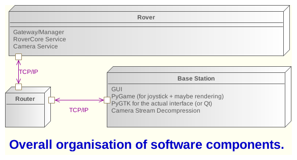

ROBOTICS NETWORKING
===================

.. image:: https://travis-ci.org/space-concordia-robotics/robotics-networking.svg
  :target: https://travis-ci.org/space-concordia-robotics/robotics-networking

Robotics networking stuff.

To install, run:

    python2.7 setup.py install --user

This will make a user install. Make sure your environment sees executables in
the local path.

If you're developing, use the following command:

    python2.7 setup.py develop --user

Any changes you make will take effect immediately. No need to reinstall.

Then you can start the server using the following command (this is the
executable that comes along with this library):

    roboticsnet-server

And if you want to give a few things a shot manually, you can test with the
client executable. You can run help to see what kind of commands are currently
supported manually.

    $ roboticsnet-client --help
    usage: Manually send commands to listener. [-h] [--move MOVE] [--turn TURN]
                                               [--queryproc QUERYPROC]

    optional arguments:
      -h, --help            show this help message and exit
      --move MOVE           send move command, given a value from 0 to 255
      --turn TURN           send turn command, given a value from 0 to 255
      --queryproc QUERYPROC
                            send query about what is currently running

So after running the server, with the above command (roboticsnet-server), you can
send a packet this way:

    $ roboticsnet-client --move 23

    Using port:  5000

    Using host:  localhost

    Send move command...

    Done!

And on the server side you should get the following:

    Send things to motors

    Received:  0x1 0x17

    Make move command

    Send things to motors

Overall Setup
=============

For the moment this is how things should look like:

Server Hooks
============

It is possible to use this module without actually altering it. The way that
this is done, is by providing hooks to the server's commands. The commands
execute whenever there is a request that is received and processed. After the
request is processed and matched against the proper command, the command is
executed. Each command is associated with a hook. So after the command (pattern)
is executed, the hook is executed right after.

There exists an example you can read in 'roboticsnet/examples/hook_example.py'.

We will go over segments of the above piece by piece in order for the reader to
have an easier time understanding what is happening.

.. code:: python

    import roboticsnet
    from roboticsnet.command_hook import CommandHook
    from roboticsnet.rover_listener import RoverListener

    def _forwardHook():
        ...

    def _turnHook():
        ...

    def _queryProcHook():
        ...

    def _reverse=_reverseHook():
        ...

    def _startVideo():
        ...

    # First you would need to define your hooks using CommandHook
    cmd_hook = CommandHook(
            forward=_forwardHook,
            turn=_turnHook,
            queryproc=_queryProcHook,
            reverse=_reverseHook,
            startVideo=_startVideoCount
            )

    l = RoverListener(hooks=cmd_hook)
    l.listen()

The above example starts a listening server with hooks. The 'def's prefixed with
'_' are our cutsom hooks. We can provide any method we want in order to get this
to execute arbitrary code. So for example, each time a 'forward' command is
received, then the '_forwardHook()' method will actually execute once the
request is done processing. This is how you attach your added, wanted behavior.

To do this we need an extra structure which stores this information (what hooks
to execute whenever a particular command is received). We use an object called
'CommandHook', and set each of these hooks individually. You can omit hooks, and
that will be fine - it simply means we do not want to bind any more behavior to
a command.

You could also create classes, and pass their methods as hooks as well. Here is
another example which is located in 'examples/hook_with_params.py'.

.. code:: python

    import roboticsnet
    from roboticsnet.command_hook import CommandHook
    from roboticsnet.rover_listener import RoverListener

    forward_count = 0

    class Counter:
        def __init__(self):
            self.count = 0

        def incr(self):
            self.count += 1

        def get(self):
            return self.count

    def _forwardHook(params):
        print "This is my custom forward hook!"
        print "And in my custom forward hook, the params I receive are: ", params
        print "And I extract the value of interest: ", params['value']

    def _turnHook():
        print "This is turn hook, where I don't care about the params (even though"
        print "we actually do receive params"

    myCounter = Counter()

    cmd_hook = CommandHook(
            forward=_forwardHook,
            turn=_turnHook,
            startVideo=myCounter.inrc
            )

    l = RoverListener(hooks=cmd_hook)
    l.listen()

    print "The startvideo command was received this many times: ", myCounter.get()

That should conclude most of what you need to know about hooks!
