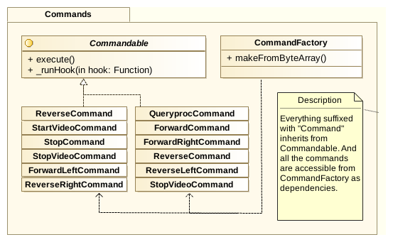

% Space Concordia Robotics Networking Documentation
% Fri Sep 25 02:27:24 EDT 2015

# Changelog

----------------- ----------------- ------------------
Name              Comment           Date
----------------- ----------------- ------------------
Simon Symeonidis  Initial Draft     Fri Sep 25 2015
----------------- ----------------- ------------------

\listoffigures

# Overall Organization
## Physical Nodes

We have two main components for this project. One is base station, and the other
is the rover. There is wireless communication between the rover, and the base
station. The base station is most likely a laptop, or a computer which can run
the software. The overall architecture is client-server, where the base station
is the client, and the rover is the server.

Wireless communications at the moment are achieved via two routers, where one is
set as a repeater. We can treat the communications as if it were two computers
on the same network. The repeater exists on the rover. Figure \ref{fig:dep}
demonstrates this organization with a UML deployment diagram.

The components are expressed as three different projects:

1. Rover Core - This is where control code for the actual hardware, motors,
   cameras, etc. exits. Source:
   [https://github.com/space-concordia-robotics/robotics-rover](https://github.com/space-concordia-robotics/robotics-rover)

2. Base Station - This is the GUI. The GUI is decoupled from the Rover Core
   project via socket communication. Source:
   [https://github.com/space-concordia-robotics/robotics-basestation](https://github.com/space-concordia-robotics/robotics-basestation)

3. Rover Networking - Anything that has to do about communication between the
   basestation, and the rover core. This is what ties the two projects together.
   As such, it was a wise move to include this as a dependency to the Rover
   Core, and Base Station projects. Source:
   [https://github.com/space-concordia-robotics/robotics-networking](https://github.com/space-concordia-robotics/robotics-networking)

## Networking

The networking library contains some common features that both the base station
and the rover need. This has been successfully abstracted by making the
networking code somewhat generic, and including a client, and a server in this
particular project. This means that:

1. The Rover Core project pulls in the networking project as a dependency.
   Therefore it has access to the server. In order to make this server able to
   perform different operations, without tampering the internals, we made it
   possible to attach hooks to different events that are received. More
   information will be discoled in Section \ref{sec:hooks}.

2. The Base Station project will pull in the networking project. Since the
   networking project also includes a client, the basestation will be able to
   use a simple interface to send information to the rover.

Now let's take a look at the internals of the project. Figure \ref{fig:ncd}
gives us a simple overview of the project. The main entry point is on the
`RoverListener` class. That is where everything starts in the library if we
don't take into consideration the `/bin/roboticsnet-server` script (that is what
you run in the command line, possibly with different parameters to set different
attributes - for example changing port number to something else).

When the server program is executed, first, a data object called the
`CommandHook` is initialized. In here we bind what behavior we want to exhibit
whenever we receive a certain command. For example if we receive a forward
command on the RoverCore, then we want to execute a method which will turn the
wheels forward. This setup is this way, because we wanted to separate the
networking library as much as possible.

The `RoverListener` awaits for information to be sent. When it receives
something, it is parsed as an array of bytes (ie: a sequence of bytes means that
we're essentially getting values in a list which range between the values 0 to
255 inclusive). The listener then uses a helper class, processes the message
received, and passes it to the `CommandFactory`.

The `CommandFactory` therefore is tasked to figure out what was received from
the base station and instatiate a proper command. The command will contain the
operations that the rover needs to perform, along with any extra data that might
have been received (for example, a move forward command will contain information
about a direction to move at, as well as magnitude, ie how fast to move).

### Method of Interaction

We wrote our own lightweight protocol for communication between the two
components. The communication uses plain bytes to form communications. If you
want to read more about this, please take a look at `PROTOCOL` on the root of
the repository of the networking code.

## Command dispatching of Server

Everything is broken down to commands. By commands we mean the command pattern
as expressed in \[1\]. The commands al implement the executable interface, and
also have a `_runHook` method attached as well. The reason why all the commands
have an execute, as well as a `_runHook` command is because we might want
operations specific to the networking code, as well as binding external use via
the hooks. A simple example would be logging for instance. Figure
\ref{fig:cmds} shows this organization.

### Hooks
\label{sec:hooks}

Hooks are simply functions passed as parameters. The way this is currently
organized is by setting the hooks to the `CommandHook` object, and passing the
object to the `RoverListener`. The rover listener then each time, when it
receives a command, checks to see if a hook has been assigned to that particular
received command. If it is the case, then it will execute the hook after the
command has been executed. In other words, it's also possible to selectively
choose hooks for different commands.

We can observe such examples through the examples in the networking repository:

~~~~python
    import roboticsnet
    from roboticsnet.command_hook import CommandHook
    from roboticsnet.rover_listener import RoverListener

    forward_count = 0
    turn_count = 0
    qp_count   = 0
    rev_count  = 0
    svid_count = 0

    def _forwardHook():
        global forward_count
        print "This is my custom forward hook!"
        forward_count += 1

    def _turnHook():
        global turn_count
        print "This is my turn hook!"
        turn_count += 1

    def _queryProcHook():
        global qp_count
        print "This is my queryproc hook!"
        qp_count += 1

    def _reverseHook():
        global rev_count
        print "This is my reverse hook!"
        rev_count += 1

    def _startVideoCount():
        global svid_count
        print "This is the startvid hook!"
        svid_count += 1

    # First you would need to define your hooks using CommandHook
    cmd_hook = CommandHook(
            forward=_forwardHook,
            turnLeft=_turnHook,
            queryproc=_queryProcHook,
            reverse=_reverseHook,
            startVideo=_startVideoCount
            )

    l = RoverListener(hooks=cmd_hook)

    print roboticsnet.__appname__, " ",  roboticsnet.__version__
    print "Starting command dispatcher..."
    l.listen()

    print "The server is completely oblivious to the following information:"
    print "  - forward commands received: ", forward_count
    print "  - turn commands received: ", turn_count
    print "  - query commands received: ", qp_count
    print "  - reverse commands received: ", rev_count
    print "  - startvid commands received: ", svid_count
~~~~

The above attaches the free functions as hooks. The functions in question simply
count how many times a message has been intercepted. When the server shuts down,
the script will report how many times different requests have been received.

# References

* \[1\] Design patterns: elements of reusable object-oriented software, Erich
  Gamma, Richard Helm, Ralph Johnson, John Vlissides
